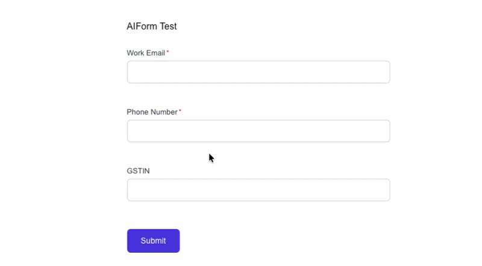
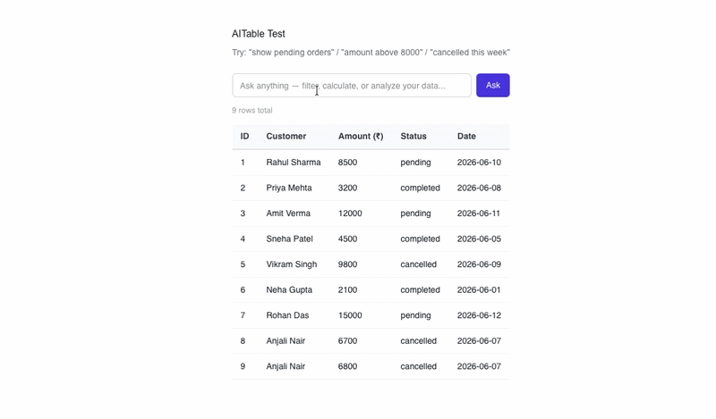
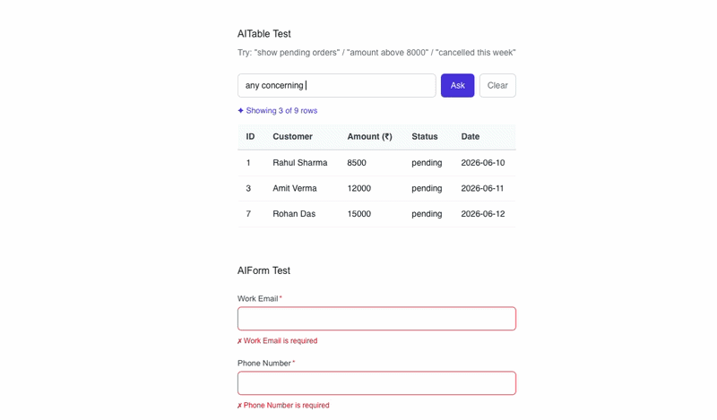

# react-ai-ux

> Stop writing "Invalid input." — let Claude explain it properly.

AI-powered React components that make your forms smarter and your data tables conversational. Powered by Anthropic's Claude.

**AIForm** validates fields in plain language — not just "invalid email" but *"This looks like a personal Gmail, most teams prefer a work email here."*

**AITable** lets users query your data in plain English — filter rows, calculate totals, or get AI insights — all from a single search box.

No backend ML setup. No vector databases. No complex configuration. Just drop in the component, point it at your Claude API proxy, and ship.


---

## Why react-ai-ux?

| | Traditional approach | react-ai-ux |
|---|---|---|
| Form errors | "Invalid email" | "This looks like a personal Gmail, use a work email" |
| Table filtering | 5 dropdown filters | Type "pending orders above 5000" |
| Data questions | Build a query builder | Type "total revenue this week" |
| Multi-language | Build separately | Auto-detects and responds in user's language |
| Setup time | Days | 10 minutes |

---

## Components

- **AIForm** — Smart field validation powered by Claude. Explains errors in plain language and guides users to fix them.
- **AITable** — Natural language data querying with 3 modes: filter rows, aggregate calculations, and AI-powered insights.

---

## Demo

### AIForm — Smart Validation


### AITable - Natural Language Querying Filtering


### AITable — Natural Language Querying Insights


---

## Install

```bash
npm install react-ai-ux
```

```bash
yarn add react-ai-ux
```

```bash
pnpm add react-ai-ux
```

> **Requires React 17 or higher.**

---

## Quick Start

### Step 1 — Set up your proxy route

Never expose your Claude API key on the frontend. Create a lightweight proxy on your backend.

**Next.js (App Router)**

```ts
// app/api/claude/route.ts
import { NextRequest, NextResponse } from 'next/server'

export async function POST(req: NextRequest) {
  const { prompt } = await req.json()

  const res = await fetch('https://api.anthropic.com/v1/messages', {
    method: 'POST',
    headers: {
      'x-api-key': process.env.ANTHROPIC_API_KEY!,
      'anthropic-version': '2023-06-01',
      'content-type': 'application/json',
    },
    body: JSON.stringify({
      model: 'claude-haiku-4-5',
      max_tokens: 500,
      messages: [{ role: 'user', content: prompt }],
    }),
  })

  const data = await res.json()
  return NextResponse.json({ result: data.content[0].text })
}
```

**Next.js (Pages Router)**

```ts
// pages/api/claude.ts
import type { NextApiRequest, NextApiResponse } from 'next'

export default async function handler(req: NextApiRequest, res: NextApiResponse) {
  const { prompt } = req.body

  const response = await fetch('https://api.anthropic.com/v1/messages', {
    method: 'POST',
    headers: {
      'x-api-key': process.env.ANTHROPIC_API_KEY!,
      'anthropic-version': '2023-06-01',
      'content-type': 'application/json',
    },
    body: JSON.stringify({
      model: 'claude-haiku-4-5',
      max_tokens: 500,
      messages: [{ role: 'user', content: prompt }],
    }),
  })

  const data = await response.json()
  res.json({ result: data.content[0].text })
}
```

**Express / Node.js**

```ts
// server.ts
import express from 'express'
const app = express()
app.use(express.json())

app.post('/api/claude', async (req, res) => {
  const { prompt } = req.body

  const response = await fetch('https://api.anthropic.com/v1/messages', {
    method: 'POST',
    headers: {
      'x-api-key': process.env.ANTHROPIC_API_KEY!,
      'anthropic-version': '2023-06-01',
      'content-type': 'application/json',
    },
    body: JSON.stringify({
      model: 'claude-haiku-4-5',
      max_tokens: 500,
      messages: [{ role: 'user', content: prompt }],
    }),
  })

  const data = await response.json()
  res.json({ result: data.content[0].text })
})
```

Add your API key to `.env`:

```env
ANTHROPIC_API_KEY=sk-ant-xxxxxxxxxxxxxxxxx
```

Get your API key at [console.anthropic.com](https://console.anthropic.com/settings/keys).

---

### Step 2 — Use the components

**AIForm**

```tsx
import { AIForm } from 'react-ai-ux'

export default function SignupPage() {
  return (
    <AIForm
      proxyUrl="/api/claude"
      fields={[
        {
          name: 'email',
          label: 'Work Email',
          type: 'email',
          required: true,
        },
        {
          name: 'phone',
          label: 'Phone Number',
          type: 'tel',
          required: true,
        },
        {
          name: 'gstin',
          label: 'GSTIN',
          type: 'text',
          context: 'Indian business tax ID. Format: 22AAAAA0000A1Z5',
        },
      ]}
      onSubmit={(values) => console.log(values)}
    />
  )
}
```

**AITable**

```tsx
import { AITable } from 'react-ai-ux'

const orders = [
  { id: 1, customer: 'Rahul Sharma', amount: 8500, status: 'pending', date: '2026-06-10' },
  { id: 2, customer: 'Priya Mehta', amount: 3200, status: 'completed', date: '2026-06-08' },
]

const columns = [
  { key: 'id', label: 'ID' },
  { key: 'customer', label: 'Customer' },
  { key: 'amount', label: 'Amount (₹)' },
  { key: 'status', label: 'Status' },
  { key: 'date', label: 'Date' },
]

export default function OrdersPage() {
  return (
    <AITable
      data={orders}
      columns={columns}
      proxyUrl="/api/claude"
    />
  )
}
```

---

## AIForm

### Props

| Prop | Type | Required | Default | Description |
|------|------|----------|---------|-------------|
| `fields` | `AIFormField[]` | Yes | — | Array of field definitions |
| `onSubmit` | `(values: Record<string, string>) => void` | Yes | — | Called with form values on valid submit |
| `proxyUrl` | `string` | No | — | Your backend proxy URL (recommended for production) |
| `apiKey` | `string` | No | — | Claude API key (for development/testing only) |
| `language` | `string` | No | auto-detect | Force a response language e.g. `"hi"`, `"en"`, `"ta"` |
| `submitLabel` | `string` | No | `"Submit"` | Label for the submit button |
| `className` | `string` | No | — | CSS class applied to the form wrapper |

### AIFormField

| Prop | Type | Required | Description |
|------|------|----------|-------------|
| `name` | `string` | Yes | Unique field identifier |
| `label` | `string` | Yes | Display label shown above the field |
| `type` | `FieldType` | Yes | `text` `email` `tel` `number` `password` `textarea` `select` |
| `required` | `boolean` | No | Makes the field required |
| `placeholder` | `string` | No | Input placeholder text |
| `context` | `string` | No | Extra hint for Claude e.g. `"Indian tax ID, format: 22AAAAA0000A1Z5"` |
| `options` | `{ label: string, value: string }[]` | No | Options for `select` type only |

### Examples

**KYC / Fintech form**

```tsx
<AIForm
  proxyUrl="/api/claude"
  fields={[
    { name: 'pan', label: 'PAN Number', type: 'text', context: 'Indian PAN card number. Format: ABCDE1234F', required: true },
    { name: 'gstin', label: 'GSTIN', type: 'text', context: 'Indian GST number. Format: 22AAAAA0000A1Z5' },
    { name: 'ifsc', label: 'IFSC Code', type: 'text', context: 'Indian bank IFSC code. Format: SBIN0001234' },
  ]}
  onSubmit={(values) => console.log(values)}
/>
```

**Enterprise signup form**

```tsx
<AIForm
  proxyUrl="/api/claude"
  fields={[
    { name: 'email', label: 'Work Email', type: 'email', required: true, context: 'Should be a company email, not Gmail or Yahoo' },
    { name: 'company', label: 'Company Name', type: 'text', required: true },
    { name: 'size', label: 'Team Size', type: 'select', options: [
      { label: '1-10', value: 'small' },
      { label: '11-50', value: 'medium' },
      { label: '50+', value: 'large' },
    ]},
    { name: 'usecase', label: 'How will you use this?', type: 'textarea' },
  ]}
  submitLabel="Request Access"
  onSubmit={(values) => console.log(values)}
/>
```

---

## AITable

### Props

| Prop | Type | Required | Default | Description |
|------|------|----------|---------|-------------|
| `data` | `Record<string, unknown>[]` | Yes | — | Array of row objects |
| `columns` | `AITableColumn[]` | Yes | — | Column key and label definitions |
| `proxyUrl` | `string` | No | — | Your backend proxy URL (recommended for production) |
| `apiKey` | `string` | No | — | Claude API key (for development/testing only) |
| `modes` | `AITableMode[]` | No | `['filter', 'aggregate', 'insight']` | Enable specific modes only |
| `language` | `string` | No | auto-detect | Force a response language |
| `pageSize` | `number` | No | `10` | Number of rows per page |
| `className` | `string` | No | — | CSS class applied to the wrapper |

### AITableColumn

| Prop | Type | Required | Description |
|------|------|----------|-------------|
| `key` | `string` | Yes | Must match a key in your data objects |
| `label` | `string` | Yes | Column header display text |

---

## AITable Modes

Control which query modes are available using the `modes` prop.

```tsx
// All modes enabled (default)
<AITable modes={['filter', 'aggregate', 'insight']} ... />

// Filter only
<AITable modes={['filter']} ... />

// Aggregate only
<AITable modes={['aggregate']} ... />

// Insight only
<AITable modes={['insight']} ... />

// Combine any two
<AITable modes={['filter', 'aggregate']} ... />
```

### Mode 1 — Filter

Returns matching rows based on natural language query.

```
"show pending orders"
"orders above 8000"
"show me singh"
"cancelled this week"
"orders from june 10 onwards"
```

### Mode 2 — Aggregate

Computes and returns a calculated answer displayed as a highlighted card.

```
"total amount of all orders"
"how many cancelled orders"
"who placed the highest order"
"average order value"
"total revenue this week"
```

### Mode 3 — Insight

Claude reasons about your data and returns a narrative analysis with relevant rows highlighted.

```
"which customers need follow up"
"any concerning trends"
"summarize overall health of orders"
"which orders are high priority"
"which customer has spent the most"
"are there any patterns in cancellations"
```

---

## Multi-language Support

Both components auto-detect the language from user input and respond in the same language. No configuration needed.

```tsx
// Auto-detect (default) — user types in any language, Claude responds in same language
<AITable proxyUrl="/api/claude" data={data} columns={columns} />

// Force a specific language
<AITable proxyUrl="/api/claude" data={data} columns={columns} language="hi" />
```

**Tested languages:** English, Hindi.

**Hindi examples:**

```
"pending orders dikhao"
"8000 se upar ke orders"
"sabhi orders ka total amount kya hai"
"sabse bada order kisne diya"
"kaunse customers ko follow up chahiye"
```

---

## Common Errors & Fixes

### `Could not validate. Please check your input.`

Claude API call failed. Check:

1. Is your `ANTHROPIC_API_KEY` set correctly in `.env`?
2. Is your proxy route returning `{ result: "..." }` format?
3. Open browser devtools → Network tab → check the `/api/claude` request for errors.

### `Could not process query. Try rephrasing.`

Claude returned an unexpected response format. Try:

1. Rephrase your query more clearly
2. Check the browser console for the raw Claude response
3. If using `modes` prop, make sure your query matches an enabled mode

### `Module not found: Can't resolve 'react-ai-ux'`

Local development issue with symlinks. Use direct path install:

```bash
npm install /absolute/path/to/react-ai-ux
```

### CORS error when using `apiKey` directly

Direct Claude API calls from the browser are blocked by CORS. Always use `proxyUrl` in production. The `apiKey` prop is for local development only.

### Form submits even with invalid fields

Make sure all required fields are filled before submitting. The `onSubmit` callback only fires when all required fields pass validation.

### Proxy returns 500 error

Check that your proxy correctly reads `req.body.prompt` and returns `{ result: string }`. Log the raw Claude response on your server to debug.

### TypeScript errors with `data` prop

Your data array must be typed as `Record<string, unknown>[]`. Cast your data if needed:

```tsx
<AITable data={orders as Record<string, unknown>[]} columns={columns} ... />
```

---

## Security

- **Never use `apiKey` prop in production.** It exposes your Claude API key in the browser.
- Always use `proxyUrl` pointing to your own backend.
- Add rate limiting to your proxy route to prevent abuse.
- Optionally add authentication to your proxy route so only logged-in users can call it.

**Rate limiting example (Next.js):**

```ts
// Simple in-memory rate limit — use Redis for production
const requests = new Map<string, number>()

export async function POST(req: NextRequest) {
  const ip = req.headers.get('x-forwarded-for') ?? 'unknown'
  const count = requests.get(ip) ?? 0

  if (count > 20) {
    return NextResponse.json({ error: 'Rate limit exceeded' }, { status: 429 })
  }

  requests.set(ip, count + 1)
  setTimeout(() => requests.delete(ip), 60000)

  // ... rest of proxy code
}
```

---

## Contributing

Contributions are welcome. Please open an issue first to discuss what you would like to change.

1. Fork the repo
2. Create your branch: `git checkout -b feat/your-feature`
3. Commit your changes: `git commit -m 'feat: add your feature'`
4. Push to the branch: `git push origin feat/your-feature`
5. Open a Pull Request

---

## Roadmap

- [ ] OpenAI / GPT support
- [ ] More language testing (Tamil, Telugu, Arabic)
- [ ] AITable column sorting
- [ ] AIForm async field validation (e.g. check if email already exists)
- [ ] Export filtered results to CSV
- [ ] Theming / dark mode support
- [ ] Storybook documentation

---

## License

MIT © [Balkar Singh](https://github.com/balkar1998)

---

## Author

Built by [Balkar Singh](https://github.com/balkar1998) — Senior Laravel & React Developer.

If this helped you, consider giving it a ⭐ on GitHub.